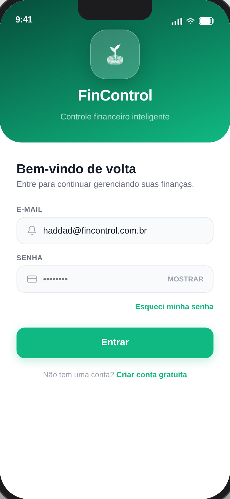
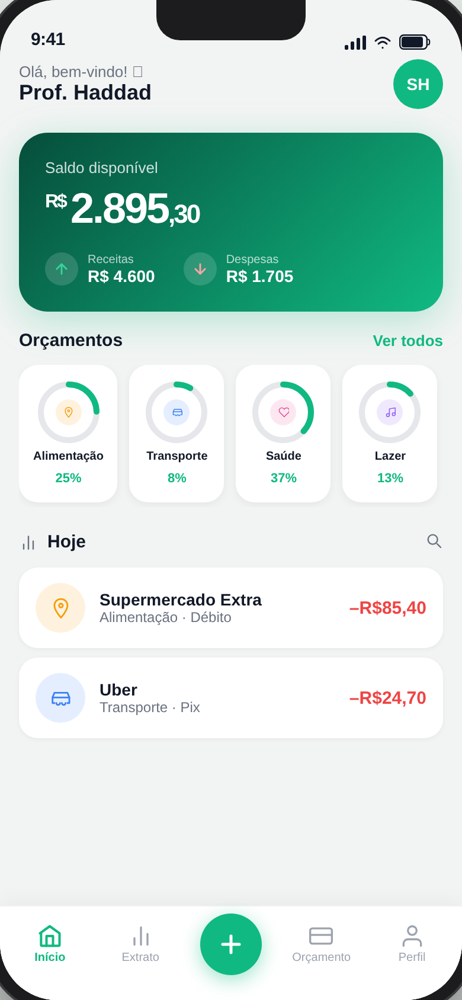
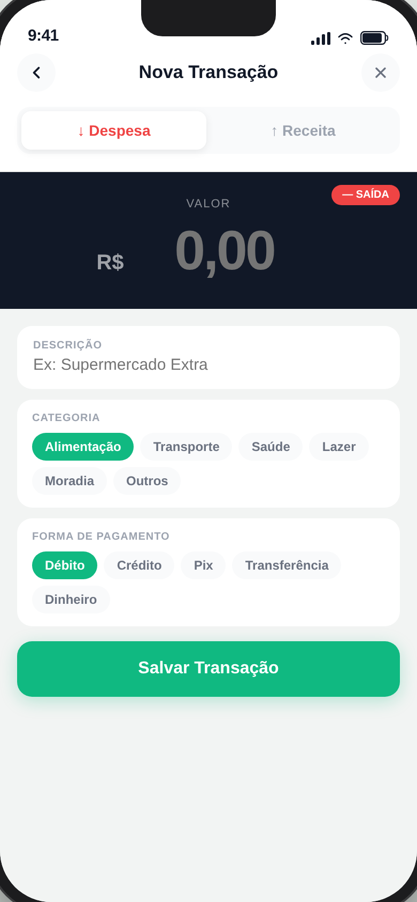
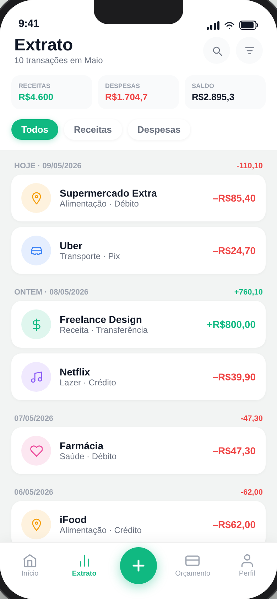

# FinControl 💰

> Personal finance control app — track expenses, set budgets, and stay in control of your money.

A lightweight, fully offline personal finance app built with React 18. No backend, no server, no installation required — just open the HTML file and start tracking.

## Screenshots

<div align="center">
  
  
  
  
</div>

## Features

- **Dashboard** — Real-time balance with income/expense rings per category
- **Transactions** — Add income or expenses in under 30 seconds
- **Statement** — Full history with filters by type, category, and date
- **Budgets** — Set monthly limits per category with 80% alert warnings
- **Export** — Download all transactions as CSV (Date, Type, Value, Category)
- **100% Offline** — All data stored locally in the browser via `localStorage`

## Getting Started

No installation needed.

```bash
# Clone the repo
git clone https://github.com/lucasamarale/fincontrol.git
cd fincontrol

# Open in browser
open index.html   # macOS
start index.html  # Windows
```

Or just download `index.html` and open it with any modern browser.

## Files

| File | Description |
|------|-------------|
| `index.html` | Main app — fully functional React 18 single-file PWA |
| `prototype.html` | Hi-fi navigable prototype — all 8 screens |

## Tech Stack

- **React 18** — Functional components + Hooks (`useState`, `useCallback`, `useEffect`)
- **Babel Standalone** — In-browser JSX compilation, zero build step
- **localStorage** — Client-side data persistence
- **HTML5** — Single file, ~62 KB, works fully offline

## License

MIT
